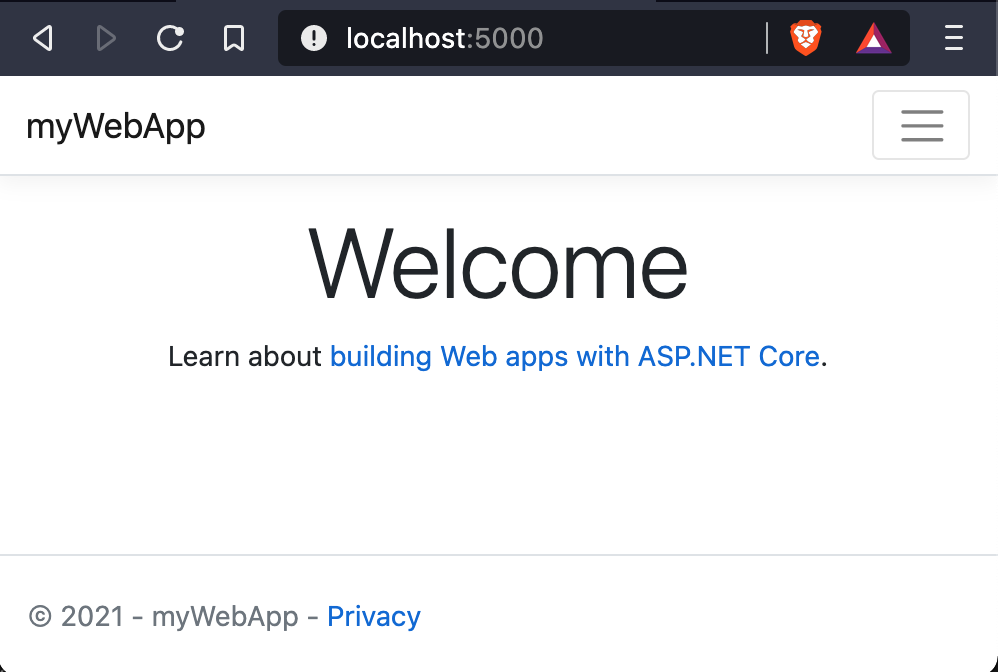

## Create a .Net application

1. In your terminal, type the following command

```
dotnet new webApp -o myWebApp --no-https
```
You should see the output in terminal

```
# dotnet new webApp -o myWebApp --no-https
Getting ready...
The template "ASP.NET Core Web App" was created successfully.
This template contains technologies from parties other than Microsoft, see https://aka.ms/aspnetcore/5.0-third-party-notices for details.

Processing post-creation actions...
Running 'dotnet restore' on myWebApp/myWebApp.csproj...
  Determining projects to restore...
  Restored /myWebApp/myWebApp.csproj (in 90 ms).
Restore succeeded.
```

this will bootstrap a new web application from template shipped with dotnet sdk. The -o parameter creates a directory named myWebApp where your app is stored.


2. Navigate to the application directory

```
cd myWebApp
```
you will have a list of files

```
# ls
Pages  Program.cs  Properties  Startup.cs  appsettings.Development.json  appsettings.json  bin	myWebApp.csproj  obj  wwwroot
```

3. In your terminal, type the following command to run your application

```
dotnet run
```
The applciation will start to listen on port 5000 for requests

```
# dotnet run
Building...
warn: Microsoft.AspNetCore.DataProtection.Repositories.FileSystemXmlRepository[60]
      Storing keys in a directory '/root/.aspnet/DataProtection-Keys' that may not be persisted outside of the container. Protected data will be unavailable when container is destroyed.
warn: Microsoft.AspNetCore.Server.Kestrel[0]
      Unable to bind to http://localhost:5000 on the IPv6 loopback interface: 'Cannot assign requested address'.
info: Microsoft.Hosting.Lifetime[0]
      Now listening on: http://localhost:5000
info: Microsoft.Hosting.Lifetime[0]
      Application started. Press Ctrl+C to shut down.
info: Microsoft.Hosting.Lifetime[0]
      Hosting environment: Development
info: Microsoft.Hosting.Lifetime[0]
      Content root path: /src
```

4. Test the application

now we can use the curl to test the connection of our web application

```
# curl http://localhost:5000
<!DOCTYPE html>
<html lang="en">
<head>
    <meta charset="utf-8" />
    <meta name="viewport" content="width=device-width, initial-scale=1.0" />
    <title>Home page - myWebApp</title>
    <link rel="stylesheet" href="/lib/bootstrap/dist/css/bootstrap.min.css" />
    <link rel="stylesheet" href="/css/site.css" />
</head>
<body>
    <header>
        <nav class="navbar navbar-expand-sm navbar-toggleable-sm navbar-light bg-white border-bottom box-shadow mb-3">
            <div class="container">
                <a class="navbar-brand" href="/">myWebApp</a>
                <button class="navbar-toggler" type="button" data-toggle="collapse" data-target=".navbar-collapse" aria-controls="navbarSupportedContent"
                        aria-expanded="false" aria-label="Toggle navigation">
                    <span class="navbar-toggler-icon"></span>
                </button>
                <div class="navbar-collapse collapse d-sm-inline-flex justify-content-between">
                    <ul class="navbar-nav flex-grow-1">
                        <li class="nav-item">
                            <a class="nav-link text-dark" href="/">Home</a>
                        </li>
                        <li class="nav-item">
                            <a class="nav-link text-dark" href="/Privacy">Privacy</a>
                        </li>
                    </ul>
                </div>
            </div>
        </nav>
    </header>
    <div class="container">
        <main role="main" class="pb-3">

<div class="text-center">
    <h1 class="display-4">Welcome</h1>
    <p>Learn about <a href="https://docs.microsoft.com/aspnet/core">building Web apps with ASP.NET Core</a>.</p>
</div>

        </main>
    </div>

    <footer class="border-top footer text-muted">
        <div class="container">
            &copy; 2021 - myWebApp - <a href="/Privacy">Privacy</a>
        </div>
    </footer>

    <script src="/lib/jquery/dist/jquery.min.js"></script>
    <script src="/lib/bootstrap/dist/js/bootstrap.bundle.min.js"></script>
    <script src="/js/site.js?v=4q1jwFhaPaZgr8WAUSrux6hAuh0XDg9kPS3xIVq36I0"></script>


</body>
</html>
```

5. Put the application in the container

Create Dockerfile with following content:

```
FROM mcr.microsoft.com/dotnet/sdk as build
COPY . ./src
WORKDIR /src
RUN dotnet build -o /app
RUN dotnet publish -o /publish

FROM mcr.microsoft.com/dotnet/aspnet as base
COPY --from=build  /publish /app
WORKDIR /app
EXPOSE 80
CMD ["./myWebApp"]

```

This is a multistage docker file. The build stage uses sdk image to build the appliation and create final articfacts in the publish folder. Then final stage copy artifacts from build stage to app folder, expose port 80 to incoming request and specify the command to run the application **myWebApp**

Now that we have defined everything we need to run in our Dockerfile we can now build an image using this file. In order to do that, we’ll need to run the following command:

```
$ docker build -t mywebapp .
[+] Building 6.0s (14/14) FINISHED
 => [internal] load build definition from Dockerfile                                                                                0.0s
 => => transferring dockerfile: 37B                                                                                                 0.0s
 => [internal] load .dockerignore                                                                                                   0.0s
 => => transferring context: 2B                                                                                                     0.0s
 => [internal] load metadata for mcr.microsoft.com/dotnet/sdk:latest                                                                0.0s
 => [internal] load metadata for mcr.microsoft.com/dotnet/aspnet:latest                                                             0.4s
 => [internal] load build context                                                                                                   0.0s
 => => transferring context: 7.38kB                                                                                                 0.0s
 => CACHED [build 1/5] FROM mcr.microsoft.com/dotnet/sdk                                                                            0.0s
 => CACHED [base 1/3] FROM mcr.microsoft.com/dotnet/aspnet@sha256:2132b0cbc71eb09dae6d9063849e5d8094777eac1e59c33238026ce7fd2cf355  0.0s
 => [build 2/5] COPY . ./src                                                                                                        0.1s
 => [build 3/5] WORKDIR /src                                                                                                        0.0s
 => [build 4/5] RUN dotnet build -o /app                                                                                            2.6s
 => [build 5/5] RUN dotnet publish -o /publish                                                                                      2.2s
 => [base 2/3] COPY --from=build  /publish /app                                                                                     0.1s
 => [base 3/3] WORKDIR /app                                                                                                         0.0s
 => exporting to image                                                                                                              0.1s
 => => exporting layers                                                                                                             0.0s
 => => writing image sha256:6acc7ebf3a1d54c7205b2881eca9f3b7cbb6b47927420e117d22aa52f7a67941                                        0.0s
 => => naming to docker.io/library/mywebapp                                                                                         0.0s

```

We can now verify that our image exists on our machine by using `docker images` command:

```
$ docker images
REPOSITORY                                                 TAG       IMAGE ID       CREATED              SIZE
mywebapp                                                   latest    6acc7ebf3a1d   25 seconds ago       210MB
```

In order to run this newly created image, we can use the docker run command and pass in the ports we want to map to and the image we wish to run.

```
$ docker run --rm  -p 5000:80 myweapp
```


- `-p 5000:80` - This exposes our application which is running on port 80 within our container on http://localhost:5000 on our local machine.
- `--rm` - This flag will clean the container after it runs
- `myweapp ` - This is the name of the image that we want to run in a container.

Now we start the brower and put http://localhost:5000 to address bar



