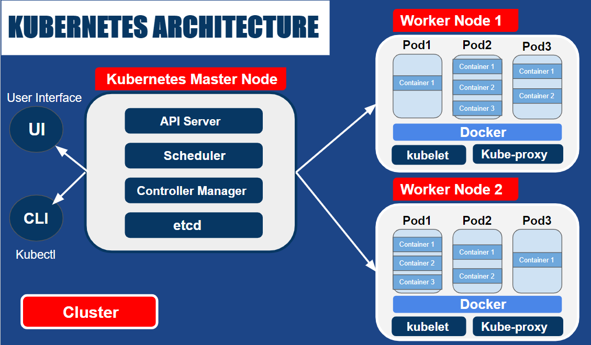
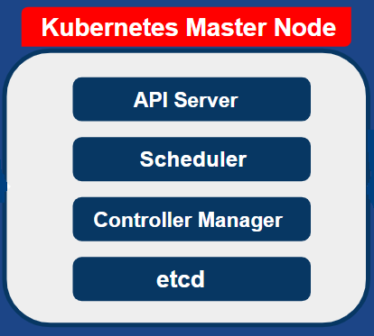

Kubernetes (a.k.a K8s) is an open-source container-orchestration system which manages the containerised applications and takes care of the automated deployment, storage, scaling, scheduling, load balancing, updates(rolling-updates), self-healing, batch-execution and monitoring of containers across clusters of hosts. 

Kubernetes was originally developed by Google labs and later donated to Cloud Native Computing Foundation (CNCF).&nbsp;

## Why Kubernetes?

There are multiple Container-Orchestration systems available today but Kubernetes has become more popular as it is cost efficient and provides a lot of options to customize deployments and has support for many different vendors. It is supported on all major public cloud service providers like GCP, Azure, AWS, Oracle Cloud, Digital Ocean etc.&nbsp;

## Kubernetes Architecture

Kubernetes follows the master/slave architecture. So, we have the master nodes and the worker nodes. The master nodes manage the worker nodes and together they form a cluster. A cluster is a set of machines called nodes. A Kubernetes cluster has at least one master node and one worker node. However, there can be multiple clusters too.&nbsp;

## Kubernetes Master Node/ Control Plane

Kubernetes Master Node/Control Plane is the controlling unit of the cluster which manages the cluster, monitors the Nodes and Pods in the cluster, and when a node fails, it moves the workload of the failed node to another working node.

The various components of the Kubernetes Master Node:

## API Server

The API Server is responsible for all communications (JSON over HTTP API). The Users, management devices, and Command line interfaces talk to the API Server to interact with the Kubernetes cluster. kubectl is the CLI tool used to interact with the Kubernetes API.

## Scheduler 

The Scheduler schedules Pods across multiple nodes based on the information it receives from etcd, via the API Server.

## Controller Manager

The Controller Manager is a component on the Master Node  that runs the Controllers. It  runs the watch-loops continuously to drive the actual cluster state towards the desired cluster state. It runs the Node/Replication/Endpoints/Service account and token Controllers and in case of the Cloud Platforms, it runs the Node/Route/Service/Volume Controllers.

## etcd

etcd is the open-source persistent, lightweight, distributed key-value database developed by CoreOS, which communicates only with the API Server. etcd can be configured externally or inside the Master Node.

## Worker Node

A Worker Node can have one or more Pods, and a Pod can have one or more Containers, and a Cluster can have multiple Worker Nodes as well as Master nodes. Node components (Kube-proxy, kubelet, Container runtime) run on every Worker Node, maintaining the running Pods and providing the Kubernetes run-time environment.

The various components of the Kubernetes Worker Node:

## Kubelet

kubelet is an agent running on each Worker Node which monitors the state of a Pod (based on the specifications from PodSpecs), and if not in the desired state, the Pod re-deploys to the same node or other healthy nodes.

## Kube-proxy

The Kube-proxy is an implementation of a network proxy (exposes services to the outside world) and a load-balancer (acts as a daemon, which watches the API server on the Master Node for the addition and removal of services and endpoints).

## Container Runtime / Docker

Kubernetes does not have the capability to directly handle containers, so it requires a Container runtime. Kubernetes supports several container runtimes, such as Docker, Containerd, Cri-o etc. 

